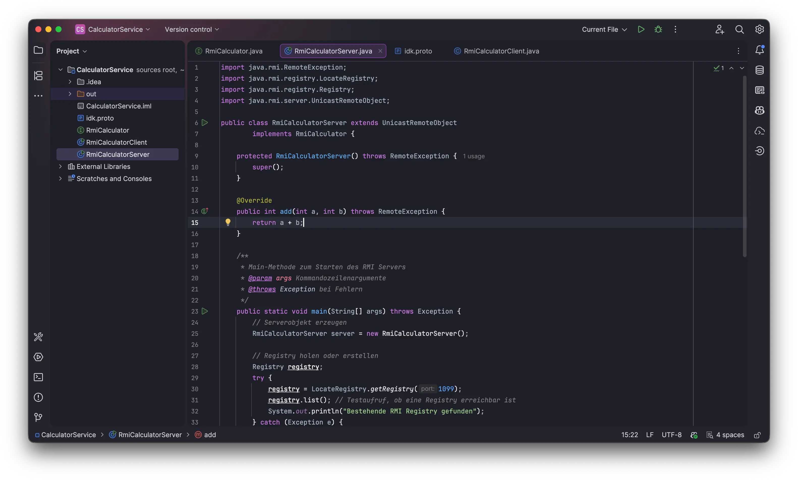
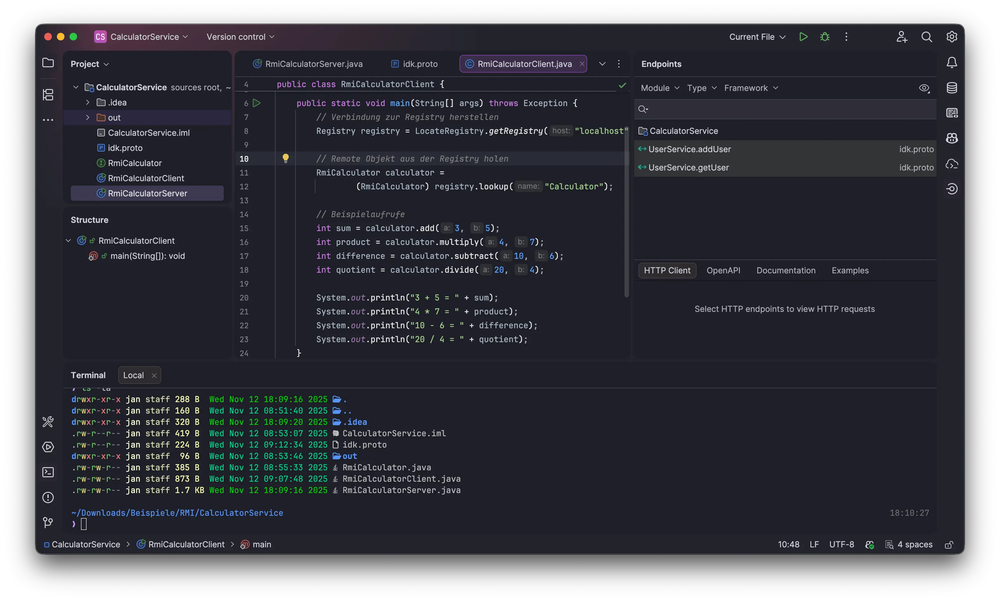

# LoveLace Theme for Jetbrains

A dark theme for JetBrains IDEs featuring shades of pink, purple, and blue, inspired by the LoveLace theme for iTerm2.

<table>
  <tr>
    <td>
      
    </td>
    <td>
      
    </td>
  </tr>
</table>

## Installation

### 1. Install via JetBrains Marketplace

1. Open your JetBrains IDE (e.g., IntelliJ IDEA, PyCharm, WebStorm, etc.).
2. Go to **Settings / Preferences**:
    - Windows/Linux: `File → Settings`
    - macOS: `IntelliJ IDEA → Preferences`
3. Navigate to **Plugins** in the sidebar.
4. Click the **Marketplace** tab.
5. Search for `LoveLace Theme`.
6. Click **Install**.
7. Restart your IDE when prompted.

### 2. Manual Installation (from downloaded plugin file)

1. Download the latest theme jar file from the [GitHub Releases page](https://github.com/KartoffelChipss/LoveLace-Theme/releases).
2. Open your JetBrains IDE.
3. Go to **Settings / Preferences**:
    - Windows/Linux: `File → Settings`
    - macOS: `IntelliJ IDEA → Preferences`
4. Navigate to **Plugins → ⚙️ (gear icon) → Install Plugin from Disk…**
5. Browse to the downloaded `.jar` file and select it.
6. Click **OK** and then **Restart IDE** if prompted.

## Activating the Theme

1. After installation and restarting your IDE, go to **Settings / Preferences**:
    - Windows/Linux: `File → Settings`
    - macOS: `IntelliJ IDEA → Preferences`
2. Navigate to **Appearance & Behavior → Appearance**.
3. In the **Theme** dropdown, select `LoveLace Theme`.
4. Click **Apply** and then **OK** to save your changes.

## License

This project is licensed under the MIT License - see the [LICENSE](https://github.com/KartoffelChipss/opds-ts/blob/main/LICENSE) file for details.
